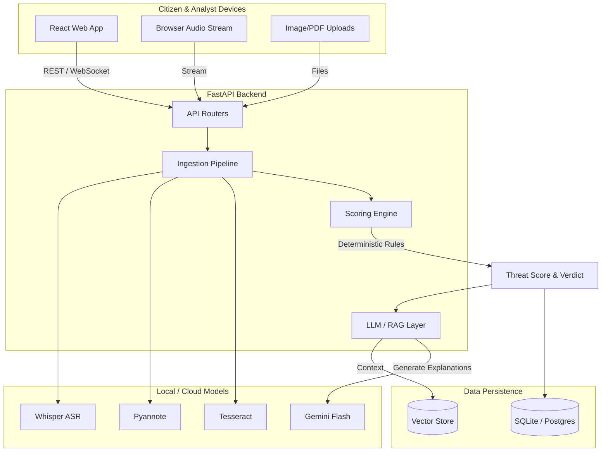
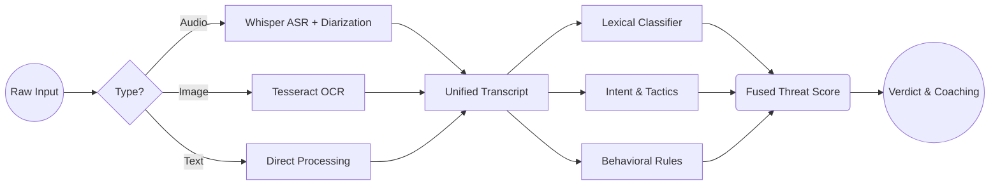

# KAVACH Architecture

KAVACH is designed as a secure, real-time intelligence engine for detecting and preventing digital scams. The architecture prioritizes speed, determinism, and privacy.

## High-Level System Architecture

## The Processing Pipeline (Ingest to Score)

## Key Architectural Decisions
1. **Deterministic Scoring First:** The core threat scoring is done via classic NLP, regex, and behavioral heuristics, not LLMs. This ensures that the engine is fast, defensible, reproducible, and cannot "hallucinate" a fake scam or clear a real one.
2. **LLM as an Explainer, Not a Decider:** Gemini is used *only* at the very end of the pipeline to translate the deterministic findings into plain, empathetic language for the citizen.
3. **Local-First Audio/Image Processing:** Whispers and Tesseract run locally on the backend, ensuring sensitive audio or documents are not shipped to 3rd party APIs for basic transcription.
4. **Pre-warming Models:** Heavy ML models are loaded into memory on API startup (`@app.on_event("startup")`), ensuring that the first request during an emergency (or a demo) is instantly processed without cold-start latency.
