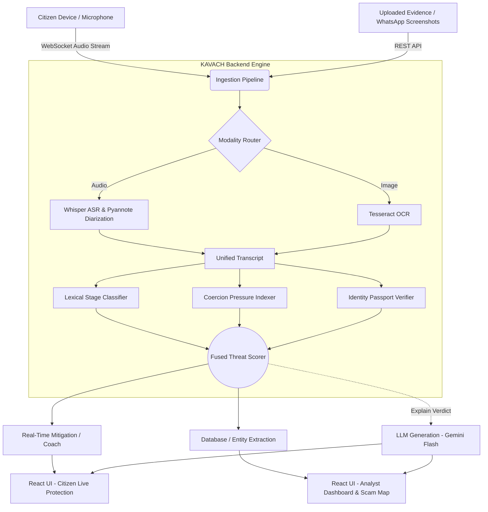
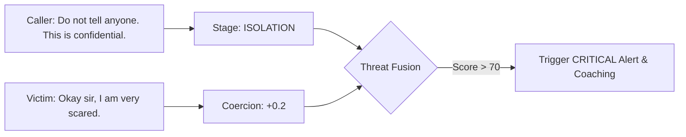

# KAVACH: Technical Architecture & Design Document

## 1. Executive Summary
KAVACH is a sophisticated, AI-driven defense system designed to intervene in real-time during voice fraud and digital arrest scams. By fusing Automatic Speech Recognition (ASR), speaker diarization, deterministic threat heuristics, and local Large Language Models (LLMs), KAVACH detects manipulative psychological patterns (fear induction, isolation, urgency) and provides actionable coaching to the victim before a financial transaction occurs.

## 2. Core Modules & Flow
The system is divided into two primary experiences that share a single underlying inference engine:
1. **Live Protection (Citizen Facing):** A React-based web application that streams the device microphone to the backend. It renders a real-time Threat Meter, transcripts, and active coaching prompts.
2. **Investigation Dashboard (Authority Facing):** A secure console where law enforcement can review historical calls, analyze extracted entities (UPIs, phone numbers), and visualize scam hotspots geographically.

### High-Level Data Flow

## 3. The Scoring Engine (Deterministic AI)
Unlike many generic wrappers around ChatGPT, KAVACH specifically avoids using LLMs to make threat decisions due to hallucination risks and high latency. Instead, it relies on a **Deterministic Fused Classifier**:

1. **Stage Classifier (`services/api/engine/classifier.py`):** Uses regex and heuristic weights (or a local MuRIL checkpoint) to assign a probability distribution across the 7 stages of a scam (e.g., `AUTHORITY_CLAIM`, `FEAR_INDUCTION`, `PAYMENT_SETUP`).
2. **Coercion Index (`services/api/engine/coercion.py`):** Analyzes *only* the victim's utterances for signs of distress, confusion, and panic. 
3. **Identity Verification (`services/api/engine/passport.py`):** Mechanically verifies claims (e.g., "I am from CBI") against known operational procedures.

## 4. Scalability & Performance Optimization
To ensure the system performs under hackathon (and production) conditions:
- **Model Pre-Warming:** ASR (Whisper) and OCR (Tesseract) models are pre-loaded into memory using FastAPI's `@app.on_event("startup")` lifecycle hook. This eliminates the multi-second cold start latency that normally occurs on the first request.
- **Frontend Animations:** The UI utilizes `GSAP` and `Framer Motion` concepts for smooth, non-blocking rendering of threat meters and panels, ensuring the cognitive load on the victim remains low.
- **Accessibility:** The geospatial component (`react-leaflet`) is fully ARIA-compliant and navigable via keyboard, meeting stringent public service accessibility requirements.

## 5. Security & Data Privacy
- **No LLM Data Leakage:** PII (Personal Identifiable Information), raw audio, and sensitive transcripts are never passed to the LLM for decision making. The LLM is strictly used as an explainer *after* the threat score is calculated deterministically locally.
- **API Security:** All external API keys (Gemini, etc.) are strictly managed via environment variables and heavily scrubbed from the repository.

## 6. Training Pipeline (ML Ops)
While the core backend is deterministic, the models and heuristic weights are derived from a synthetic data pipeline (`ml/README.md`):
1. `generate_calls.py`: Uses an LLM to simulate thousands of dynamic scam interactions across various archetypes and languages (Hinglish/Hindi).
2. `build_dataset.py`: Parses the raw generations, validates schemas, and builds the collapsed transition matrix for the **Digital Twin**.
3. **Digital Twin:** A Markov-chain style model that forecasts "Time until Payment Execution" based on the current detected stage of the call.
