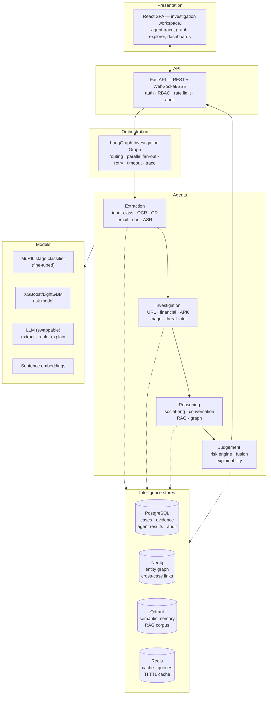
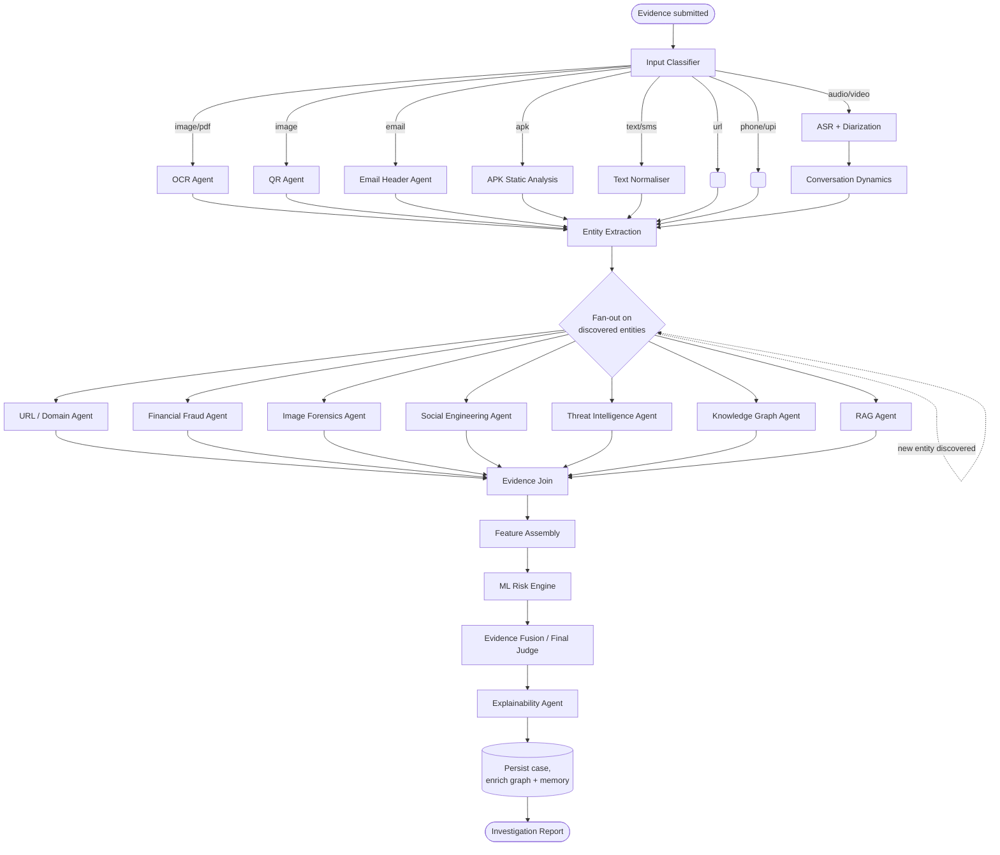
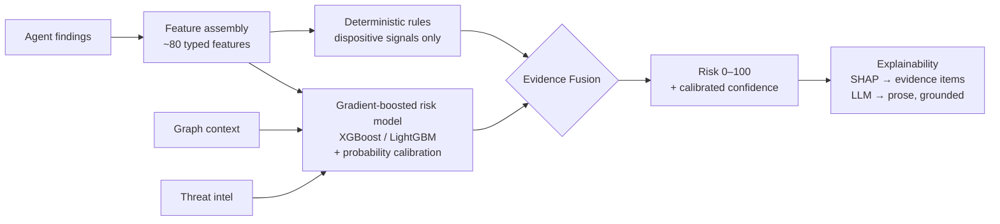
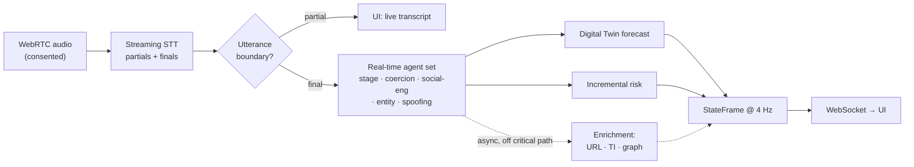

# AegisAI — System Architecture

> **AegisAI: An Agentic Digital Public Safety Platform for Autonomous
> Multi-Modal Fraud Investigation**

The central loop is never `INPUT → LLM → SCAM/NOT SCAM`. It is:

```
INPUT → EXTRACT → INVESTIGATE → CORRELATE → REASON → SCORE → EXPLAIN → ACT
```

Every design decision below serves that loop.

---

## 1. Layered view



**Rule:** an arrow into L4/L5 may fail. Every one of them has a fallback that
still answers, and the failure is recorded in `state.degraded`.

---

## 2. The Investigation Graph (LangGraph)

The orchestrator is a directed graph, not a pipeline. Nodes are agents; edges
are conditional on state.



### Why a graph and not a pipeline

- **Conditional execution** — an APK agent must not run on an audio file.
- **Parallel fan-out** — URL, financial, threat-intel and graph lookups are
  independent; running them concurrently is the difference between a 4 s and a
  25 s investigation.
- **Recursion with a bound** — a URL agent may discover a new domain, which
  deserves its own investigation. Depth is capped (default 2) to keep latency
  and cost bounded.
- **Reproducible traces** — every node records inputs, outputs, latency and
  degradation. That trace is simultaneously the debug tool, the UI's agent view,
  and the paper's per-agent success-rate table.

### Node execution policy

Every node runs under the same contract:

| Property | Rule |
|---|---|
| Timeout | Per-agent budget (default 8 s; TI 3 s; APK 120 s async) |
| Retry | 2 attempts, exponential backoff, only for transient/network errors |
| Failure | Never fails the investigation. Emits `AgentResult(status=DEGRADED)` and appends to `state.degraded` |
| Isolation | An agent may not read another agent's internals — only `state` |
| Determinism | Given identical state + fixed seeds + cached TI, output is reproducible |

---

## 3. `InvestigationState` — the shared contract

Master §24, made concrete and typed. Lives in `schema/` alongside the existing
`StateFrame`, and is generated to TypeScript by the same contract check.

```python
class InvestigationState(BaseModel):
    # --- identity ---
    case_id: str
    org_id: str
    created_by: str
    created_at: datetime
    mode: Literal["batch", "realtime"]

    # --- input ---
    inputs: list[EvidenceItem]           # raw uploads + typed refs
    input_types: list[InputType]         # from the classifier

    # --- extraction ---
    extracted_text: list[ExtractedText]  # text + lang + confidence + source_ref
    entities: EntitySet                  # urls, domains, phones, upi_ids,
                                         # emails, accounts, ips, apps, orgs
    transcript: Optional[Transcript]     # reuses the existing call contract

    # --- investigation ---
    agent_results: list[AgentResult]     # append-only, one per node execution
    threat_intel: list[TIRecord]         # source · timestamp · confidence · ref
    graph_context: Optional[GraphContext]# neighbours, prior cases, centrality
    rag_context: list[RetrievedChunk]    # text + citation, never invented

    # --- judgement ---
    risk_features: dict[str, float]      # the ML model's exact input vector
    risk_score: float = Field(ge=0, le=100)
    confidence: float = Field(ge=0, le=1)
    classification: Optional[FraudCategory]
    evidence: list[EvidenceFinding]      # ranked, each with confidence + source
    recommendations: list[Recommendation]

    # --- operational ---
    degraded: list[str]                  # every capability that fell back
    trace: list[TraceSpan]               # node · t_start · t_end · status
```

### `AgentResult` — every agent returns this shape

```python
class AgentResult(BaseModel):
    agent: str                    # "url_investigation"
    version: str                  # "1.3.0" — pinned for reproducibility
    status: Literal["ok", "degraded", "skipped", "error"]
    confidence: float = Field(ge=0, le=1)
    findings: list[Finding]       # each: label, value, confidence, source, detail
    features: dict[str, float]    # contribution to the ML feature vector
    latency_ms: int
    provenance: list[str]         # data sources actually consulted
    error: Optional[str]
```

This single shape is what makes the paper's *agent disagreement / confidence
analysis* possible, and what makes the UI's agent panel generic.

---

## 4. Scoring architecture — hybrid by construction

The most important design decision in the project. Master §16 is explicit: **do
not let an LLM decide the score.**



Four independent scoring paths, deliberately:

1. **ML risk model** — learned, calibrated, the primary number.
2. **Deterministic rules** — floor/ceiling for genuinely conclusive signals
   (a domain registered 2 days ago hosting a login form imitating a bank).
   Kept narrow; over-use of dispositive rules is how false positives are born.
3. **Graph context** — a UPI ID seen in 4 prior confirmed cases is evidence the
   ML model cannot see from the artefact alone.
4. **LLM** — extracts structured fields, ranks findings, writes the explanation.
   **Never** produces the number.

The **Evidence Fusion** node reconciles them and, critically, records *when they
disagree*. Disagreement is a research output, not a bug.

---

## 5. Real-time subgraph

Batch investigation can take 20 s. A live call cannot. The real-time path is a
**pruned subgraph** with a hard latency budget, sharing the same state contract.



- Agents in the real-time set must return in **< 400 ms p95**.
- Slow agents (URL, threat-intel, APK) run **asynchronously** and merge into a
  later frame — they never hold up a warning.
- The existing 4 Hz `StateFrame` contract is reused verbatim. This is why the
  inherited contract matters: real-time was designed in from the start.

---

## 6. Target repository structure

Preserves git history and the working contract; adds the agent layer.

```
aegisai/
├── apps/
│   └── web/                          # React SPA (Vite) — see ADR-0001
│       └── src/
│           ├── pages/                # investigation, graph, dashboards, admin
│           ├── components/
│           │   ├── investigation/    # launcher, progress, report
│           │   ├── agents/           # React Flow trace view
│           │   ├── graph/            # Cytoscape explorer
│           │   ├── intel/  map/  report/
│           └── types/contract.ts     # generated — never hand-edited
│
├── services/
│   ├── api/                          # FastAPI
│   │   ├── agents/                   # ── NEW: one package per agent
│   │   │   ├── base.py               #    Agent protocol + AgentResult
│   │   │   ├── registry.py
│   │   │   ├── classify/  ocr/  qr/  url/  email/  apk/  image/
│   │   │   ├── financial/  social/  threat_intel/  rag/  graph/
│   │   │   ├── risk/  fusion/  explain/
│   │   │   ├── inherited/            #    the engine below, wrapped, unchanged
│   │   ├── orchestration/            # ── NEW: LangGraph
│   │   │   ├── graph.py  nodes.py  policy.py  trace.py
│   │   ├── investigations/           # ── NEW: lifecycle — intake, runner, report
│   │   ├── engine/                   # inherited call engine → conversation agents
│   │   ├── ingest/  intel/  shield/  rag/  routes/
│   │   ├── stores/                   # ── NEW: evidence + blobs; neo4j / qdrant / redis
│   │   └── tests/
│   └── worker/                       # ── NEW: Celery — APK, video, TI refresh
│
├── packages/
│   └── aegis_core/                   # shared domain: taxonomy, entities, Hinglish
│
├── ml/
│   ├── corpus/                       # generation, paraphrase, validation
│   ├── training/                     # stage classifier, risk model, RSSIE
│   ├── evaluation/                   # promotion gates, backend comparison
│   └── data/                         # DVC-tracked; artifacts moved out of git
│
├── research/                         # ── NEW: the paper
│   ├── experiments/                  # exp1..exp8 from RESEARCH.md
│   ├── ablations/
│   ├── notebooks/
│   ├── results/                      # committed JSON + figures
│   └── paper/
│
├── schema/                           # THE contract — Pydantic ↔ TypeScript
├── infra/
│   ├── docker/                       # Dockerfiles
│   ├── compose/                      # postgres · neo4j · qdrant · redis
│   └── seeds/
├── docs/                             # this directory
└── scripts/
```

### Migration principle

Move by `git mv`, never by copy-delete — history matters for a capstone
defence. Each move is its own commit with tests green on both sides.

---

## 7. Technology decisions

| Layer | Choice | Rationale |
|---|---|---|
| Orchestration | **LangGraph** | Master §22. Explicit state, conditional edges, checkpointing, per-node retry. CrewAI's role-play abstraction fits poorly with deterministic non-LLM agents. |
| Backend | **FastAPI + Python 3.12** | Inherited, correct, async-native. 3.9 → 3.12 is a Phase-0 blocker. |
| Frontend | **React + Vite (kept)** | See **ADR-0001** — deliberate deviation from the master doc's Next.js. |
| Relational | **PostgreSQL** | JSONB for agent results, real concurrency. SQLite stays as the zero-setup fallback. |
| Graph | **Neo4j** | See **ADR-0002**. NetworkX retained as the offline fallback. |
| Vector | **Qdrant** | Named preference; good filtered-search story for per-org isolation. |
| Cache/queue | **Redis + Celery** | Needed the moment APK/video/TI leave the request path. |
| LLM | **Provider-abstracted** | `LLMBackend` protocol. Gemini today, local Llama/Gemma supported. Never hard-coded — master §22. |
| Embeddings | **Sentence-Transformers** (multilingual) | Must handle Hindi/Hinglish. |
| ASR | **faster-whisper** | 4× realtime on CPU; streaming-capable. |
| OCR | **PaddleOCR** primary, Tesseract fallback | Better on Devanagari and screenshot layouts. |
| Risk ML | **XGBoost + LightGBM** | Tabular, fast, SHAP-native, strong baselines for the paper. |
| Deploy | **Docker Compose** | Master §22 — Kubernetes explicitly not warranted. |

---

## 8. Security architecture

Security is not a phase; it is a property of specific components.

| Control | Where | Why |
|---|---|---|
| **SSRF defence** | URL agent | Attacker-supplied URLs. Allowlist egress, block RFC1918 + link-local + `169.254.169.254`, re-resolve DNS after redirect, cap redirect depth, no `file://`/`gopher://`. **The single highest-risk component in AegisAI.** |
| **Malware isolation** | APK agent | Static analysis only, in a network-less container, read-only mount, resource caps. Never execute. |
| **Upload validation** | API gateway | Size cap enforced *while reading* and filename sanitisation at intake; the magic-byte type check runs on the classifier node so a declared/detected mismatch becomes a `type_conflict` finding rather than a 415 with nothing recorded. Per-org quota is not built. |
| **Tenant isolation** | Every store | `org_id` on every row, node and vector payload. Enforced in the repository layer, not the route. |
| **Secrets** | Config | Env only, never committed. Verified: no key has ever entered git history. |
| **PII minimisation** | Ingest + storage | Raw audio not retained by default; transcripts redacted before leaving the org boundary; research datasets anonymised. |
| **Consent** | Live call | Explicit gate, visible indicator, configurable retention, user-initiated deletion. |
| **Audit** | Platform | Append-only log of logins, exports, overrides, and every investigation. |
| **Rate limiting** | Middleware | Already implemented; extend per-org and per-agent (TI budget). |

---

## 9. What "done" means for any component

Per master §40.15, no component is complete until all six are answered in its
module docstring:

1. **Why** it is needed
2. **What data** it consumes
3. **What** it outputs (the typed `AgentResult`)
4. **How** it connects to other agents
5. **How** it is evaluated (which metric, on which split)
6. **What its limitations are** (stated, not hidden)

Plus, mechanically:

- [ ] Tests pass, including a false-positive case on benign input
- [ ] `schema/check_contract.py` consistent
- [ ] Frontend typecheck + build clean
- [ ] Registered in the agent registry with a version string
- [ ] Degradation path exercised by a test
- [ ] Latency recorded in the trace
