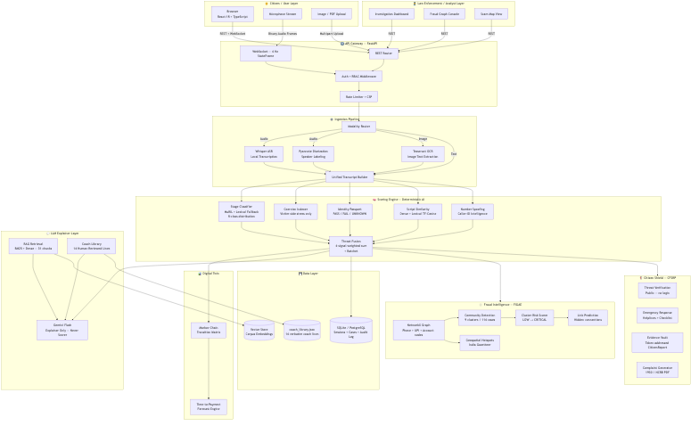
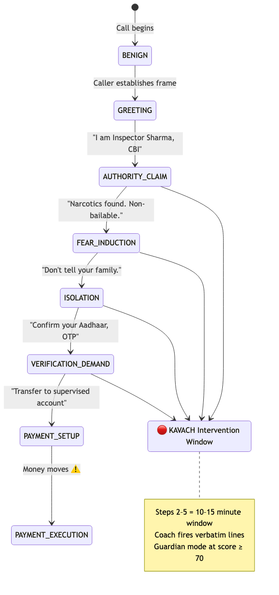
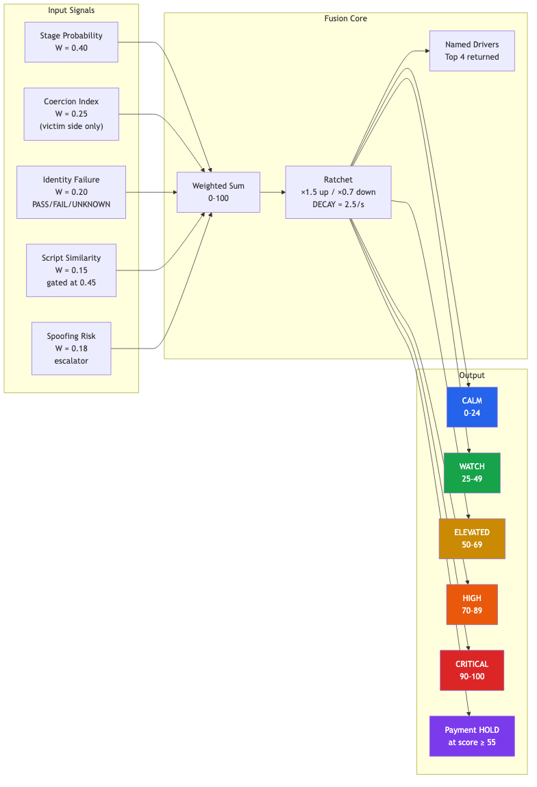
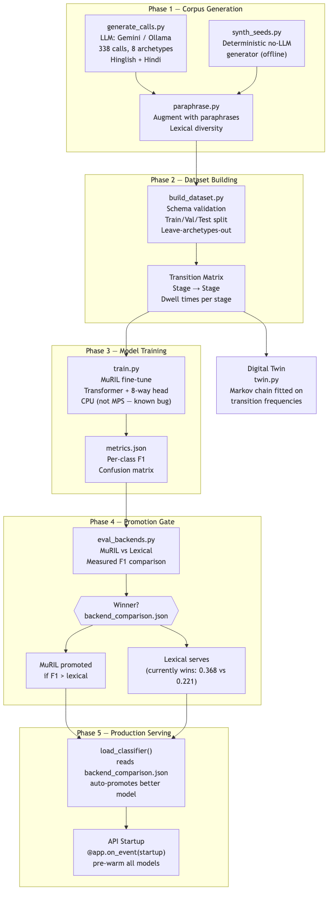
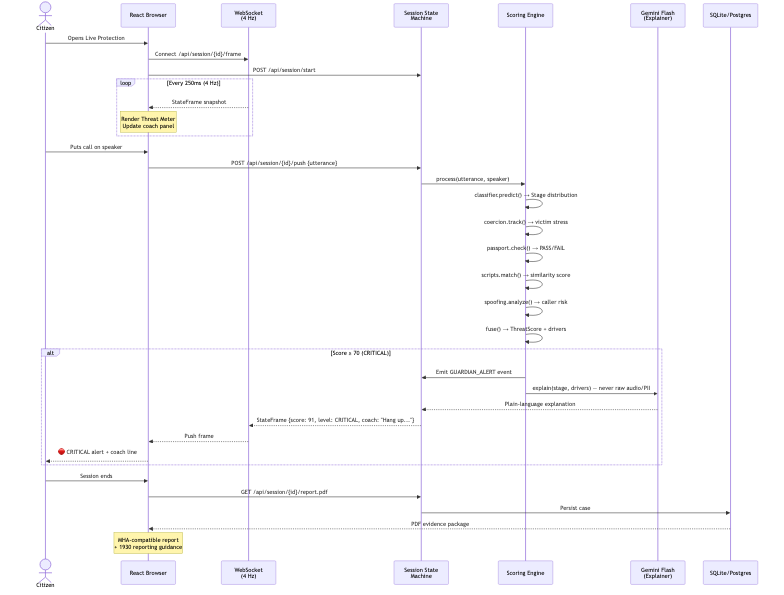
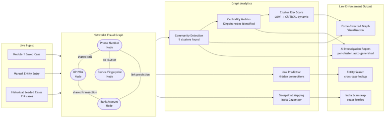
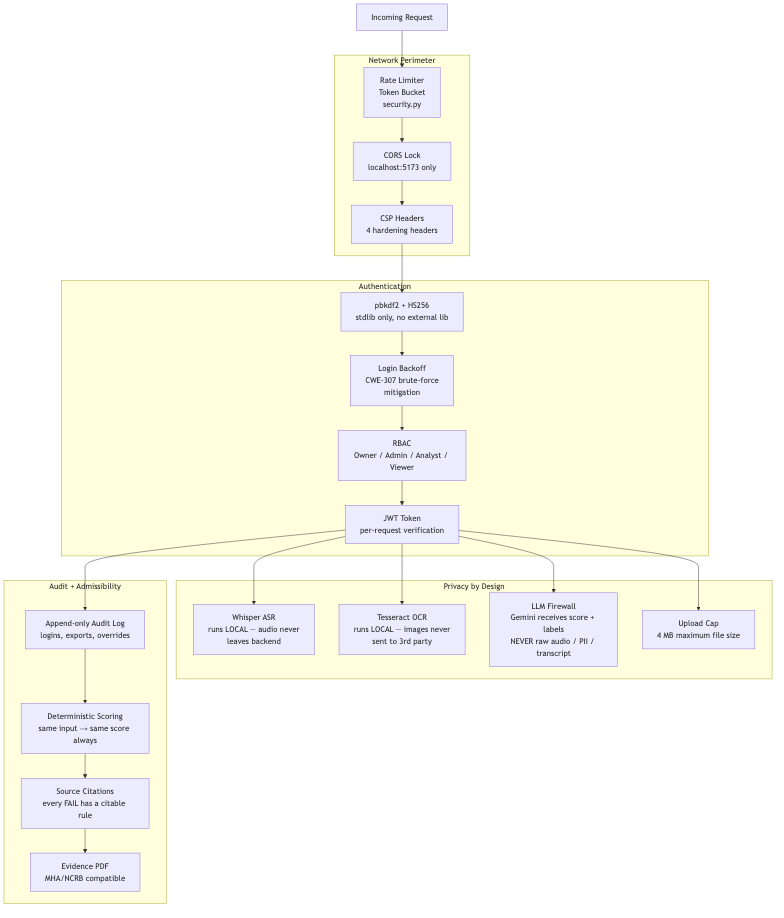
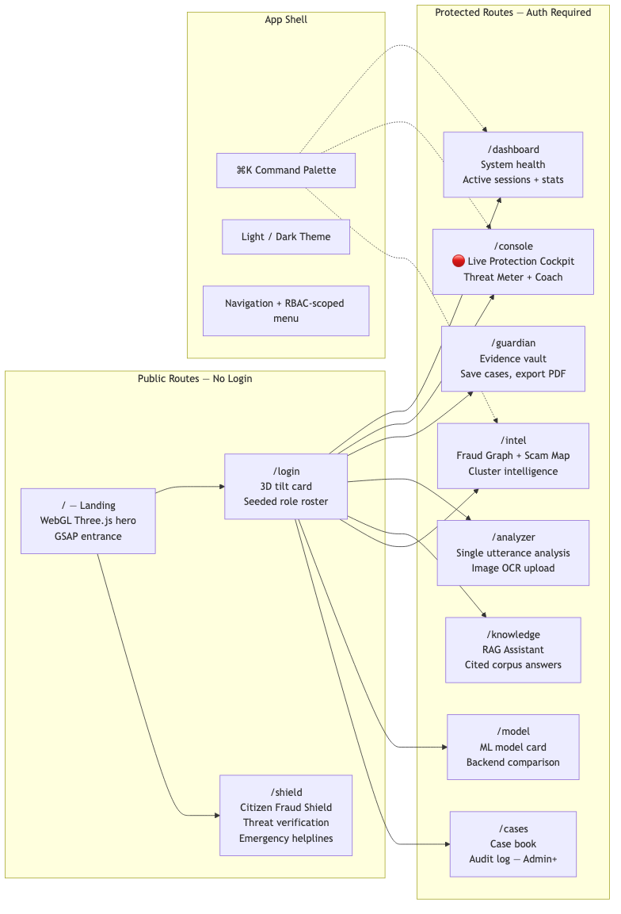
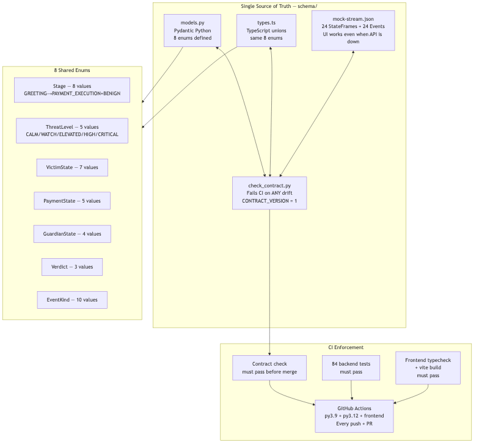
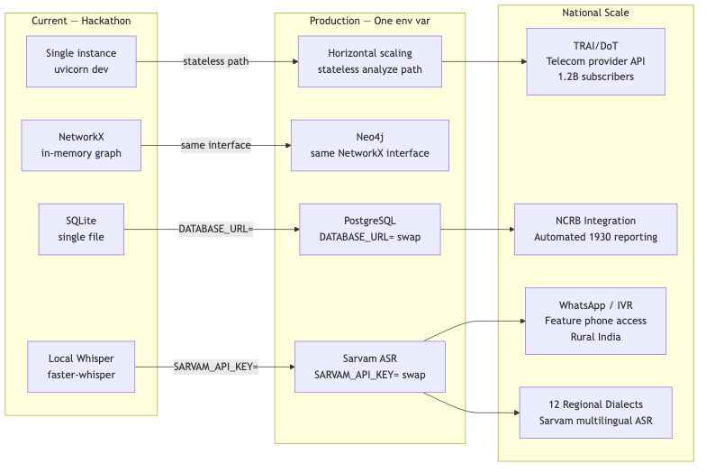

# KAVACH — Complete System Architecture

## 1. Top-Level System Architecture

---

## 2. The 7-Stage Scam Arc Detection Model

---

## 3. The Threat Fusion Engine (Signal Flow)

---

## 4. ML Training Pipeline (Offline, Reproducible)

---

## 5. Data Flow — Live Protection Session

---

## 6. Module 2 — FIGAE Fraud Intelligence Graph

---

## 7. Security Architecture

---

## 8. Frontend Route Architecture

---

## 9. Schema Contract Architecture

---

## 10. Scalability Path

